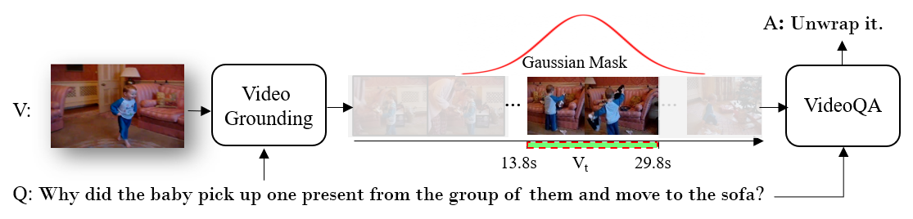

# <a href="https://arxiv.org/abs/2309.01327">Can I Trust Your Answer? Visually Grounded Video Question Answering</a>
<details open>
<summary> <b>Introduction</b> </summary>
We study visually grounded VideoQA by forcing vision-language models (VLMs) to answer questions and simultaneously ground the relevant video moments as visual evidences. We show that this task is easy for human yet is extremely challenging for existing VLMs, revealing that the strong QA performance of these models are actually derived from a short-cut learning versus faithful reasoning. By defining grounded VQA, we hope to discourage such short-cut learning and spark more interpretable and trustworthy techniques. This repository holds our data and code to facilitate future research.
</details>

<div align="center">
  
</div>

## Environment
Assume you have installed Anaconda, please do the following to setup the environment:
```
>conda create -n videoqa python==3.8
>conda activate videoqa
>conda install pytorch==1.8.1 torchvision==0.9.1 cudatoolkit=11.1 -c pytorch -c nvidia 
>git clone https://github.com/doc-doc/NExT-GQA.git
>pip install -r requirements.txt
```
## Preparation
Please create a data folder outside this repo, so you have two folders in your workspace 'workspace/data/' and 'workspace/NExT-GQA/'. 

Please download the related <a href="https://drive.google.com/file/d/101W4r6ibXJE2IOr6MINbNIMC3MFiN-us/view?usp=sharing">video feature</a> or <a href="https://drive.google.com/file/d/1jTcRCrVHS66ckOUfWRb-rXdzJ52XAWQH/view">raw videos</a>. Extract the feature into ```workspace/data/nextqa/CLIPL/```. If you download the raw videos, you need to decode each video at 6fps and then extract the frame feature of CLIP via the script provided in ```code/TempCLIP/tools/extract_feat.sh```.

Please follow the instructions in ```code``` for training and testing the respective models.

## Result Visualization (NExT-GQA)
<div align="center">
  
</div>

## Citation 
```
@inproceedings{xiao2023nextgqa,
  title={Can I Trust Your Answer? Visually Grounded Video Question Answering},
  author={Xiao, Junbin and Angela, Yao and Li, Yicong and Chua, Tat-Seng},
  booktitle={arXiv},
  pages={preprint},
  year={2023},
}
```
