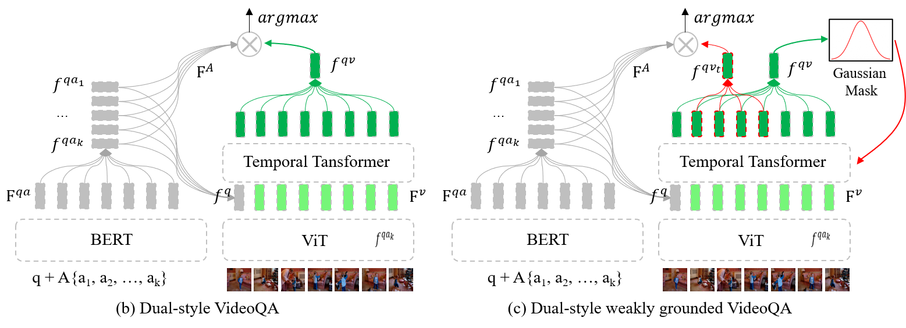
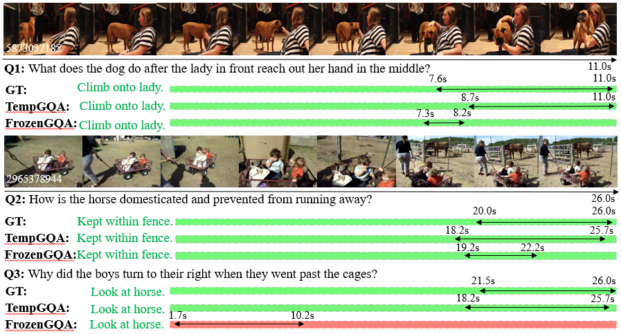

## Introduction
TempCLIP follows the dual-style architecture and encodes each frame into a global representation with <a href="https://github.com/openai/CLIP">CLIP</a>. Different frame representations are then connected via a lightweight temporal transformer layer. A schematic diagram is shown below:

<div align="center">
  
</div>

## Preparation
Please download and extract the <a href="https://drive.google.com/file/d/1OOIVRN7dxd_2P0TfMR4bQSS6vyS34_hh/view?usp=drive_link">checkpoint</a> file into ```workspace/data/gmodels/NG+/TempCLIP/```. 

## Inference
```
./shell/next_test_dual.sh 0
```
## Evaluation
QA
```
python eval_next.py --folder TempCLIP --mode test
```
GroundedQA 
```
python eval_ground.py
``` 
## Result Visualization (NExT-GQA)
<div align="center">
  
</div>

## Train
```
./shell/nextqa_train_dual.sh 0
```
It will train the model and save to the folder 'workspace/data/gmodels/'

## Citation 
```
@inproceedings{xiao2023nextgqa,
  title={Can I Trust Your Answer? Visually Grounded Video Question Answering},
  author={Xiao, Junbin and Angela, Yao and Li, Yicong and Chua, Tat-Seng},
  booktitle={arXiv},
  pages={preprint},
  year={2023},
}
```
