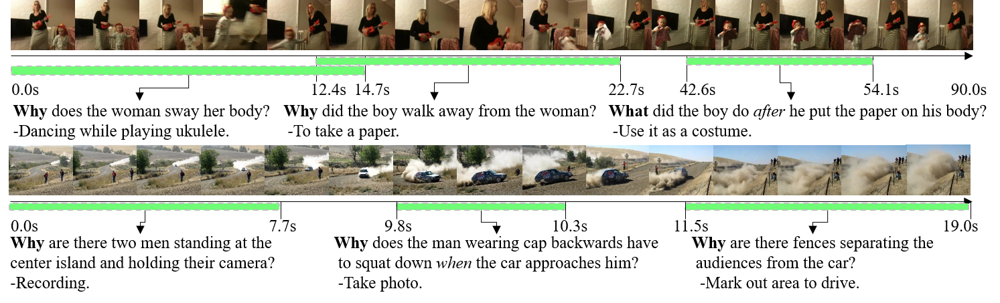

## Instructions
<b>train.csv</b>: QA annotations are identical to <a href="https://github.com/doc-doc/NExT-QA">NExT-QA</a> train.csv, except that we slightly change the format by replacing the correct answer_id with the corresponding text answer.

<b>test.csv/val.csv</b>: QA annotations that are subset of NExT-QA test.csv/val.csv. We exclude the questions that rely on global video content and those in the descriptive group.

<b>gsub_test.json/gsub_val.json</b>: time span annotations corresponding to the QAs in test.csv/val.csv
Note：
```
{"10001787725": #video_id
    {
      "duration": 34, #Video duration (s)
      "location": #Segment
        {
          "1": [[1.2, 5.8]], #Segment corresponding to question id qid 1
          "3": [[12.1, 17.1], [20.0, 23.5], [29.7, 33.2]] #Segment corresponding to question id qid 3
          ...
        },
      fps: 29.97 #frame rate
    }
...
}
```

<b>frame2time_test.json/frame2time_val.json</b>: map the frame id into time seconds.

<b>map_vid_vidorID</b>: map the video_id in QA annotation file into video path.

<b>upbd_test.json/upbd_val.json</b>: sampled video timestamps for each video.

## Visualization
<div align="center">
  
</div>

